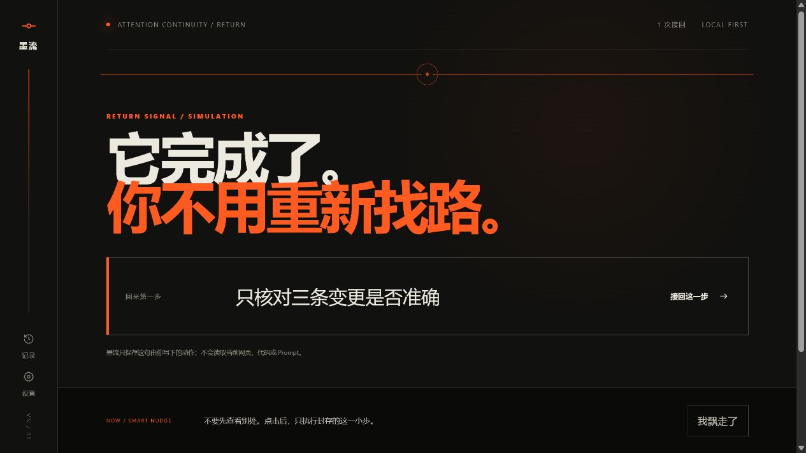
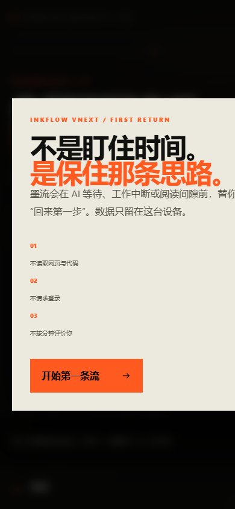

# W｜工作流与回归验证

验证日期：2026-07-23

## 1. 自动质量门

- `npm run lint`：通过，0 error / 0 warning。
- `npm test`：生产构建成功；21 项 Node 测试全部通过。
- 覆盖层：八状态机、规范事件、adapter、schema/storage、SSR、PWA 离线、旧版资产、响应式与隐私合同。

## 2. 任务书工作流矩阵

| 必测流程 | 当前证据 | 结果 |
| --- | --- | --- |
| 首次用户 | 390×844 Chromium 首次进入，欢迎层完整可见且主按钮在首屏 | 通过 |
| 已有用户 | 浏览器保留既有 profile/session，刷新后进入原状态 | 通过 |
| AI 任务 20 秒完成 | 真实浏览器早期回归自动进入 `RETURN SIGNAL / SIMULATION`；状态机定时合同 | 通过 |
| AI 任务 5 分钟完成 | 真实浏览器选择 5 分钟，进入 Waiting，再进入 Recovery | 通过 |
| AI 失败 | 真实浏览器点击“任务失败”，出现“先接回判断，再处理失败”且 checkpoint 保留 | 通过 |
| 用户提前回来 | 状态机测试 `EARLY_RETURN`，UI 在 Waiting/Recovery 均提供入口 | 通过 |
| 用户没有回来 | 以 +24 小时 fake clock hydrate，仍保持 Waiting，不伪造完成或惩罚 | 通过 |
| 用户切换到抖音/网页 | `PAGE_VISIBILITY` 测试只增加 hiddenCount，状态仍 Waiting；不推断访问目标 | 通过（诚实降级） |
| 浏览器不支持通知 | 运行时进入 `unsupported` 决定并使用标题 + Return Gate；静态合同覆盖 | 通过 |
| 用户拒绝权限 | `denied` 持久化测试；按钮禁用且不会再次调用权限请求 | 通过 |
| 离线 | Service Worker 测试真实令 network fetch 失败，缓存应用壳返回 200 | 通过 |
| 页面刷新 | 真实 5 分钟 Recovery 在 00:10 刷新，挂载后恢复 Recovery，计时推进到 00:21 | 通过 |
| 多标签页 | 双标签真实回归：第二标签 Rejoin 后，第一标签收到提示并从 Return 进入 Active | 通过 |
| 移动端 | 本机 Edge headless 以 390×844 真正视口渲染；修复首轮标题横向溢出后复测 | 通过 |
| 低能量模式 | 四场景状态测试保留 lowEnergy；profile 可跨刷新恢复 reducedGuidance | 通过 |
| 不想被提醒 | 静默提醒持久化，关闭系统通知但保留页面标题与 Return Gate | 通过 |
| 只想留白 | `blank` 会真实进入 Recovery，可结束留白继续等待 | 通过 |
| 阅读模式 | 与主内核同构的 mode 测试；Prototype 03 已做真实交互迁移 | 通过 |
| 冥想模式 | 与主内核同构的 mode 测试；Prototype 03 已做真实交互迁移 | 通过 |
| 工作模式 | mode/Recovery/Return 状态测试；生产 UI 使用真实工作文案 | 通过 |

## 3. 真实浏览器路径 A｜手动闭环

1. 首次引导点击“开始第一条流”。
2. 输入目标 `让 AI 重构认证状态机`。
3. 输入回来第一步 `先跑 reducer 的失败路径测试`。
4. 手动封存、完成、接回、完成第一步。
5. Review 选择“完整接回”。
6. 历史中出现该动作与接回指标。

结果：首次引导—checkpoint—Return—Active—Review—History 完整成功。

## 4. 真实浏览器路径 B｜20 秒模拟与刷新

1. 新建 `让 AI 生成发布说明`，下一步 `只核对三条变更是否准确`。
2. 选择明确标注的“20 秒演示”。
3. 等待 1.6 秒后刷新，页面恢复原 checkpoint。
4. 到达目标时间后自动进入 `RETURN SIGNAL / SIMULATION`。

结果：模拟来源没有伪装成真实集成，刷新不重置 expectedAt。

## 5. 真实浏览器路径 C｜5 分钟 Recovery、失败与多标签

1. 选择“5 分钟”，封存 `只确认恢复页能否继续等待`。
2. 选择“看远处”，真实进入 `ATTENTION CONTINUITY / RECOVERY`。
3. 在 00:10 刷新，挂载后仍在 Recovery，计时推进到 00:21。
4. 点击“任务失败”，Return 文案变为“任务没有完成。先接回判断，再处理失败。”
5. 第二标签打开同一应用并点击 Return Gate。
6. 第一标签收到“已同步到最新状态”，自动进入 Active。

结果：Recovery 不是样式别名；失败不擦除上下文；跨标签只传 id/revision 也能正确恢复。

## 6. 本轮真实缺陷与修复

### 缺陷 1｜Hydration mismatch

第一次桌面取证发现服务端默认 profile 与客户端 localStorage/`Date.now()` 初始化不一致。引入确定性 `FlowRoot` 后，服务端只渲染稳定壳，客户端挂载后读取本地数据；复测无脚本错误。

### 缺陷 2｜Recovery 只存在于设计文档

完成审计发现旧实现把微行动留在 Waiting 内，没有任务书要求的真实 Recovery 状态。现已增加 `SELECT_MICRO_ACTION` / `COMPLETE_RECOVERY`、独立 UI 与模拟计时延续，并用状态机和浏览器刷新验证。

### 缺陷 3｜移动端首帧标题溢出

390×844 首轮 Chromium 截图显示确定性壳标题超出右边界。移动字号从 14vw 收窄为 11.5vw、增加 `overflow-wrap` 后复测，欢迎层与主按钮完整落在视口内。

## 7. 视觉证据

桌面 Return Gate：

移动首次进入（390×844，修复后）：

## 8. 仍需发布后复验

- 正式域名的 Service Worker 更新与旧 cache 淘汰；
- 一台真实触屏手机上的软键盘、safe-area 和通知权限行为；
- Cloudflare 发布后的完整 20 秒线上链路。

这些属于真实部署/设备回归，不冒充本地已完成；它们不会改变当前本地 MVP 闭环成立的结论。
